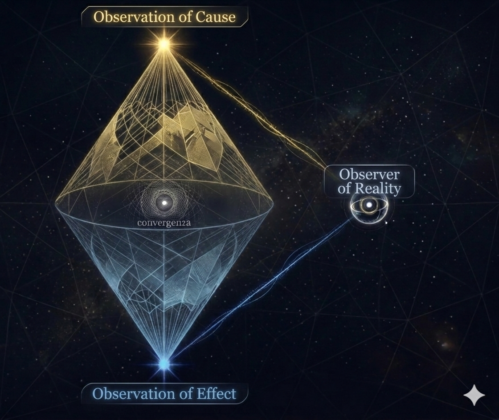

# Fractal Triad

**Zoom-Coherent Knowledge Organization with Cause-Effect Separation and LLM Cross-Scale Validation**

*Federico D'Ambrosio & Claude (Anthropic AI) — March 2026*

---

## What is this?

AI systems represent knowledge on a single flat plane: causes, effects, principles, and measurements all have the same status. This flatness produces systematic errors — false correlations between unrelated domains, confusion between causal mechanisms and observable consequences, and incoherent explanations that mix scales.

**Fractal Triad** is a framework that organizes knowledge along two dimensions:

- **Nature**: is this a cause or an effect?
- **Scale**: at what zoom level does this operate? (cosmological → fundamental)

The core principle — the **Zoom Coherence Principle** — states that cause and effect must be matched at the same scale of observation. Cross-scale transitions are allowed but must be explicitly tracked and validated through reasoning, not just semantic proximity.

## Architecture

```
┌────────────────────────────────────────────────────────┐
│                    ORCHESTRATOR                        │
│                                                        │
│  Phase 0: Classify all items (zoom level + nature)     │
│                        ↓                               │
│  Phase 1: 9 LOCKED OBSERVERS (one per scale)           │
│           → Verified same-scale cause-effect links     │
│                        ↓                               │
│  Phase 2: GAP ANALYSIS                                 │
│           → Structural asymmetry, mysteries, orphans   │
│                        ↓                               │
│  Phase 3: UNLOCKED OBSERVER (LLM via Ollama)    [v4]   │
│           → Cross-scale validation with reasoning      │
│                        ↓                               │
│  Phase 4: MYSTERY ANALYSIS (LLM)                [v4]   │
│           → Hypothesized causes for unexplained effects│
└────────────────────────────────────────────────────────┘
```

**v3** (locked observers only) uses semantic embeddings to find cause-effect pairs at the same scale. Pure vector matching — no LLM needed.

**v4** (unlocked observers) adds a local LLM as a reasoning filter for cross-scale candidates. Where v3 stops with a "?" and a disclaimer, v4 actually reasons about whether the link is genuine or spurious.



## Key Results

### Structural Asymmetry

On a curated dataset of 62 items, the system reveals a deep structural asymmetry in human knowledge:

| Level                         | Effects | Causes |
| ----------------------------- | ------- | ------ |
| Shallow (cosmic → organism)   | 28      | 4      |
| Deep (cellular → fundamental) | 5       | 20     |

We live immersed in effects. Causes operate in depth.

### The Scaling Experiment

The same 6 cross-scale candidates were evaluated by three models of increasing size:

| Model   | Params | Genuine | False | Uncertain | False Positive Rate |
| ------- | ------ | ------- | ----- | --------- | ------------------- |
| Gemma 3 | 1B     | 5       | 0     | 1         | 83%                 |
| Gemma 3 | 4B     | 0       | 5     | 1         | 0%                  |
| Gemma 3 | 12B    | 1       | 3     | 2         | 17%                 |

**1B** = yes-man (validates cardiac pacemaker → financial leverage as causal).  
**4B** = radical skeptic (rejects everything, including defensible candidates).  
**12B** = calibrated reasoner (validates emergence → entanglement at 0.75 confidence, rejects obvious spurious links at 0.95-0.99, leaves genuinely uncertain cases as uncertain).

The framework inadvertently works as a **benchmark for multi-scale causal reasoning** — a capability no existing benchmark specifically measures.

## Quick Start

### Requirements

- Python 3.10+
- [Ollama](https://ollama.ai) (for v4 only)

### Installation

```bash
pip install fastembed numpy matplotlib
ollama pull gemma3:4b   # or any model you prefer
```

### Run v3 (no LLM needed)

```bash
python fractal_triad_v3.py
```

### Run v4 (requires Ollama)

```bash
# Make sure Ollama is running
ollama serve

# Edit OLLAMA_MODEL in fractal_triad_v4.py if needed
python fractal_triad_v4.py
```

### Change the LLM model

In `fractal_triad_v4.py`, modify:

```python
OLLAMA_MODEL = "gemma3:12b"  # or "llama3:8b", "mistral:7b", etc.
```

## File Structure

```
├── fractal_triad_v3.py          # Core: embeddings + locked observers
├── fractal_triad_v4.py          # Extension: LLM unlocked observers
├── fractal_triad_paper_v4_IT.md # Full paper (Italian)
├── fractal_triad_paper_v4_EN.md # Full paper (EN)
└── README.md                    # This file
```

## How would AI labs use this?

1. **As a constraint in chain-of-thought reasoning** — tag each reasoning step with a scale level, penalize untracked cross-scale jumps.

2. **As a metadata layer for RAG systems** — classify every chunk by scale and nature, constrain retrieval to same-scale matches, return cross-scale candidates separately with appropriate skepticism.

3. **As a causal reasoning benchmark** — run the cross-scale validation with different models and measure the false positive curve. The framework produces a metric for multi-scale causal reasoning that no existing benchmark captures.

## On the origin of this framework

This framework originated from a non-analytical intuition — a geometric vision of the two cones received by the first author during a meditative state, subsequently formalized through iterative dialogue with an AI system. We report this origin for transparency, not as a validity argument. The results stand or fall on their own technical merits.

## Citation

```
@misc{dambrosio2026fractaltriad,
  title={Fractal Triad: Zoom-Coherent Knowledge Organization with Cause-Effect Separation},
  author={D'Ambrosio, Federico and Claude (Anthropic AI)},
  year={2026},
  url={https://github.com/federosso/fractal-triad}
}
```

## License

MIT
